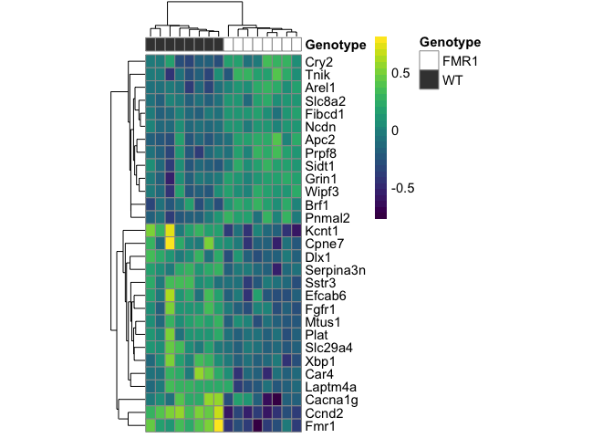

RNAseq gene expression analysis with DESeq2
-------------------------------------------

This workflow was modified from the DESeq2 tutorial found at: <https://www.bioconductor.org/packages/release/bioc/vignettes/DESeq2/inst/doc/DESeq2.pdf>

First I load a handful of packages for data wrangling, gene expression analysis, data visualization, and statistics.

``` r
library(dplyr) ## for filtering and selecting rows
library(plyr) ## for renmaing factors
library(reshape2) ## for melting dataframe
library(DESeq2) ## for gene expression analysis
library(edgeR)  ## for basic read counts status
library(magrittr) ## to use the weird pipe
library(genefilter)  ## for PCA fuction
library(ggplot2)
library(cowplot) ## for some easy to use themes
library(car) ## stats
library(VennDiagram) ## venn diagrams
library(pheatmap) ## awesome heatmaps
library(viridis) # for awesome color pallette
library(magrittr) ## to use the weird pipe
library(ggrepel) ## for labeling volcano plot

## load functions 
source("figureoptions.R")
source("functions_RNAseq.R")

## set output file for figures 
knitr::opts_chunk$set(fig.path = '../figures/02_RNAseq/')
```

We are ready to calculate differential gene expression using the DESeq package. For simplicity, I will use the standard nameing of "countData" and "colData" for the gene counts and gene information, respectively.

``` r
colData <- read.csv("../data/fmr1ColData.csv", header = T)
countData <- read.csv("../data/fmr1CountData.csv", header = T, check.names = F, row.names = 1)

## remove outliers
colData <- colData %>% 
  filter(RNAseqID != "16-123B")  %>% 
  filter(RNAseqID != "16-125B") %>% 
  droplevels()

savecols <- as.character(colData$RNAseqID) 
savecols <- as.vector(savecols) 
countData <- countData %>% dplyr::select(one_of(savecols)) 


# colData must be factors
cols = c(1:6)
colData[,cols] %<>% lapply(function(x) as.factor(as.character(x)))

# summary data
colData %>% select(Genotype, APA)  %>%  summary()
```

    ##  Genotype    APA    
    ##  FMR1:8   Yoked:14  
    ##  WT  :6

Total Gene Counts Per Sample
----------------------------

this could say something about data before normalization

``` r
## stats
dim(countData)
```

    ## [1] 22485    14

``` r
counts <- countData
dim( counts )
```

    ## [1] 22485    14

``` r
colSums( counts ) / 1e06  # in millions of reads
```

    ##  16-116B  16-117D  16-118B  16-118D  16-119B  16-119D  16-120B  16-120D 
    ## 2.082858 1.437951 2.903268 2.191553 2.619744 2.593812 2.869718 2.194511 
    ##  16-122B  16-122D  16-123D  16-124D  16-125D  16-126B 
    ## 2.778324 3.203040 2.551592 2.595799 2.054411 2.700689

``` r
table( rowSums( counts ) )[ 1:30 ] # Number of genes with low counts
```

    ## 
    ##    0    1    2    3    4    5    6    7    8    9   10   11   12   13   14 
    ## 5159  432  366  319  241  179  188  162  124  146  123  109  100   87   81 
    ##   15   16   17   18   19   20   21   22   23   24   25   26   27   28   29 
    ##   95   91   68   73   86   65   76   57   65   71   51   60   52   43   54

``` r
rowsum <- as.data.frame(colSums( counts ) / 1e06 )
names(rowsum)[1] <- "millioncounts"
rowsum$sample <- row.names(rowsum)

ggplot(rowsum, aes(x=millioncounts)) + 
  geom_histogram(binwidth = 1, colour = "black", fill = "darkgrey") +
  theme_classic() +
  scale_x_continuous(name = "Millions of Gene Counts per Sample",
                     breaks = seq(0, 8, 1),
                     limits=c(0, 8)) +
  scale_y_continuous(name = "Number of Samples")
```


    ## class: DESeqDataSet 
    ## dim: 22485 14 
    ## metadata(1): version
    ## assays(1): counts
    ## rownames(22485): 0610007P14Rik 0610009B22Rik ... Zzef1 Zzz3
    ## rowData names(0):
    ## colnames(14): 16-116B 16-117D ... 16-125D 16-126B
    ## colData names(6): RNAseqID Mouse ... Date daytime

    ## class: DESeqDataSet 
    ## dim: 16894 14 
    ## metadata(1): version
    ## assays(1): counts
    ## rownames(16894): 0610007P14Rik 0610009B22Rik ... Zzef1 Zzz3
    ## rowData names(0):
    ## colnames(14): 16-116B 16-117D ... 16-125D 16-126B
    ## colData names(6): RNAseqID Mouse ... Date daytime

    ## estimating size factors

    ## estimating dispersions

    ## gene-wise dispersion estimates

    ## mean-dispersion relationship

    ## final dispersion estimates

    ## fitting model and testing

    ## -- replacing outliers and refitting for 134 genes
    ## -- DESeq argument 'minReplicatesForReplace' = 7 
    ## -- original counts are preserved in counts(dds)

    ## estimating dispersions

    ## fitting model and testing

    ## [1] 43 15  6  6  5  4  4  4  3

    ##             Df Sum Sq Mean Sq F value Pr(>F)
    ## Genotype     1  41.95   41.95   2.505  0.139
    ## Residuals   12 200.97   16.75

    ##             Df Sum Sq Mean Sq F value Pr(>F)
    ## Genotype     1   2.37   2.371   0.337  0.572
    ## Residuals   12  84.39   7.033

    ##             Df Sum Sq Mean Sq F value Pr(>F)
    ## Genotype     1   2.92   2.921   1.029   0.33
    ## Residuals   12  34.07   2.839

    ##             Df Sum Sq Mean Sq F value Pr(>F)  
    ## Genotype     1  12.43   12.43   6.755 0.0233 *
    ## Residuals   12  22.09    1.84                 
    ## ---
    ## Signif. codes:  0 '***' 0.001 '**' 0.01 '*' 0.05 '.' 0.1 ' ' 1


    ## quartz_off_screen 
    ##                 2

    ## quartz_off_screen 
    ##                 2

Number of differentially expressed genes per two-way contrast
=============================================================

``` r
#calculate significance of all two way comparisions
# see source "functions_RNAseq.R" 

contrast1 <- resvals(contrastvector = c("Genotype", "FMR1", "WT"), mypval = 0.05) # 4
```

    ## [1] 8

``` r
contrast2 <- resvals(contrastvector = c("Genotype", "FMR1", "WT"), mypval = 0.2) # 31
```

    ## [1] 20




Write the two files
-------------------

``` r
write.csv(vsd, file = "../data/02_vsd.csv", row.names = T)
write.csv(rlddf, file = "../data/02_rlddf.csv", row.names = T)
```
