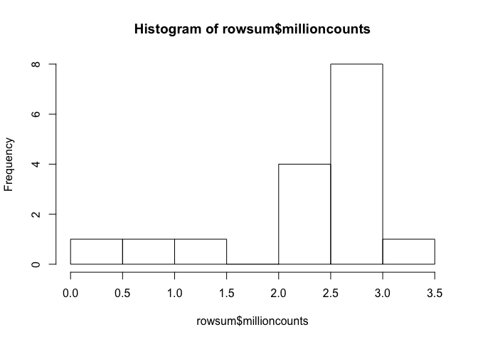
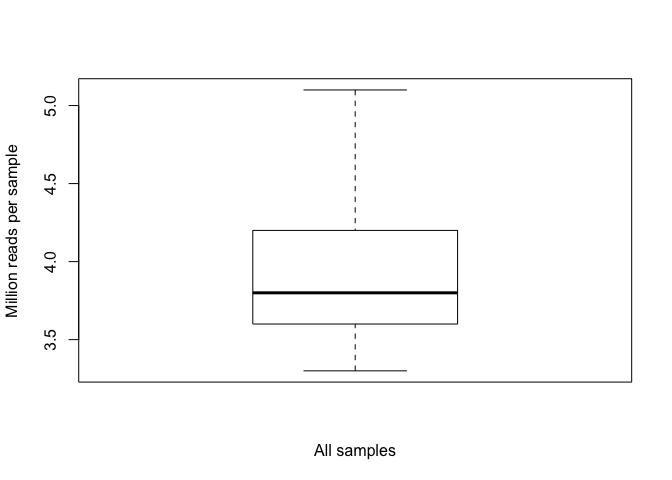
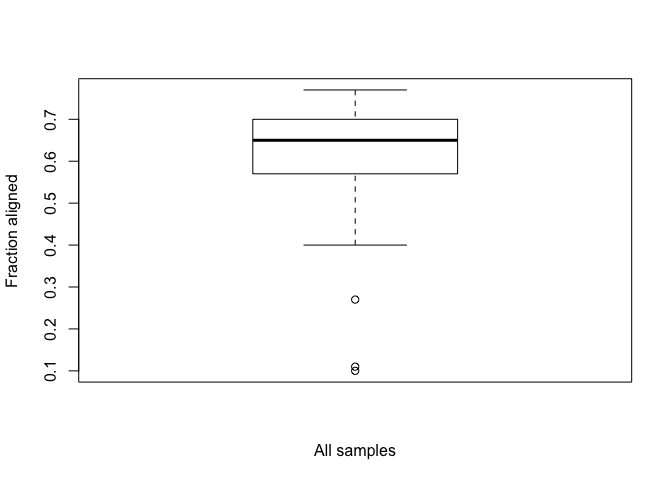

RNAseq gene expression analysis with DESeq2
-------------------------------------------

This workflow was modified from the DESeq2 tutorial found at:
<a href="https://www.bioconductor.org/packages/release/bioc/vignettes/DESeq2/inst/doc/DESeq2.pdf" class="uri">https://www.bioconductor.org/packages/release/bioc/vignettes/DESeq2/inst/doc/DESeq2.pdf</a>

First I load a handful of packages for data wrangling, gene expression
analysis, data visualization, and statistics.

``` r
library(dplyr) ## for filtering and selecting rows
library(DESeq2) ## for gene expression analysis
library(edgeR)  ## for basic read counts status
library(genefilter)  ## for PCA fuction
library(magrittr) ## to use the weird pipe
library(ggplot2) ## for aweseom plots
library(cowplot) ## for some easy to use themes
library(car) ## stats
library(pheatmap) ## awesome heatmaps
library(viridis) # for awesome color pallette

## load functions 
source("functions_RNAseq.R")

## set output file for figures 
knitr::opts_chunk$set(fig.path = '../figures/02_RNAseq/')
```

We are ready to calculate differential gene expression using the DESeq
package. For simplicity, I will use the standard nameing of “countData”
and “colData” for the gene counts and gene information, respectively.

``` r
colData <- read.csv("../data/fmr1ColData.csv", header = T)
countData <- read.csv("../data/fmr1CountData.csv", header = T, check.names = F, row.names = 1)

## remove outliers
#colData <- colData %>% 
#  filter(RNAseqID != "16-123B")  %>% 
#  filter(RNAseqID != "16-125B") %>% 
#  droplevels()

savecols <- as.character(colData$RNAseqID) 
savecols <- as.vector(savecols) 
countData <- countData %>% dplyr::select(one_of(savecols)) 

# colData must be factors
cols = c(1:6)
colData[,cols] %<>% lapply(function(x) as.factor(as.character(x)))

# daytime
colData$daytime3 <- as.character(colData$daytime)
colData$daytime3 <- ifelse(grepl("beforenoon", colData$daytime3), "daytime", 
                           ifelse(grepl("afternoon", colData$daytime3), "daytime", "nighttime"))
colData$daytime3 <- as.factor(colData$daytime3)

# summary data
colData %>% select(Genotype, APA, daytime3)  %>%  summary()
```

    ##  Genotype    APA          daytime3
    ##  FMR1:8   Yoked:16   daytime  :8  
    ##  WT  :8              nighttime:8

Total Gene Counts Per Sample
----------------------------

this could say something about data before normalization

``` r
dim(countData)
```

    ## [1] 22485    16

``` r
counts <- countData
dim( counts )
```

    ## [1] 22485    16

``` r
colSums( counts ) / 1e06  # in millions of reads
```

    ##  16-116B  16-117D  16-118B  16-118D  16-119B  16-119D  16-120B  16-120D 
    ## 2.082858 1.437951 2.903268 2.191553 2.619744 2.593812 2.869718 2.194511 
    ##  16-122B  16-122D  16-123B  16-123D  16-124D  16-125B  16-125D  16-126B 
    ## 2.778324 3.203040 0.846916 2.551592 2.595799 0.485904 2.054411 2.700689

``` r
table( rowSums( counts ) )[ 1:30 ] # Number of genes with low counts
```

    ## 
    ##    0    1    2    3    4    5    6    7    8    9   10   11   12   13   14 
    ## 5081  425  334  312  223  183  179  162  135  130  137  105  103   95   93 
    ##   15   16   17   18   19   20   21   22   23   24   25   26   27   28   29 
    ##   78  103   77   75   67   82   68   59   65   68   57   52   61   51   53

``` r
rowsum <- as.data.frame(colSums( counts ) / 1e06 )
names(rowsum)[1] <- "millioncounts"
rowsum$sample <- row.names(rowsum)

ggplot(rowsum, aes(x=millioncounts)) + 
  geom_histogram(binwidth = 1, colour = "black", fill = "darkgrey") +
  theme_classic() +
  scale_x_continuous(name = "Millions of Gene Counts per Sample") +
  scale_y_continuous(name = "Number of Samples")
```


``` r
hist(rowsum$millioncounts)
```



DeSeq2
------

``` r
## create DESeq object using the factor Genotyp
dds <- DESeqDataSetFromMatrix(countData = countData,
                              colData = colData,
                              design = ~ Genotype)

dds$Genotype <- factor(dds$Genotype, levels=c("WT", "FMR1")) ## specify the factor levels 

dds # view the DESeq object - note numnber of genes
```

    ## class: DESeqDataSet 
    ## dim: 22485 16 
    ## metadata(1): version
    ## assays(1): counts
    ## rownames(22485): 0610007P14Rik 0610009B22Rik ... Zzef1 Zzz3
    ## rowData names(0):
    ## colnames(16): 16-116B 16-117D ... 16-125D 16-126B
    ## colData names(7): RNAseqID Mouse ... daytime daytime3

``` r
dds <- dds[ rowSums(counts(dds)) > 1, ]  # Pre-filtering genes with 0 counts
dds # view number of genes afternormalization and the number of samples
```

    ## class: DESeqDataSet 
    ## dim: 16979 16 
    ## metadata(1): version
    ## assays(1): counts
    ## rownames(16979): 0610007P14Rik 0610009B22Rik ... Zzef1 Zzz3
    ## rowData names(0):
    ## colnames(16): 16-116B 16-117D ... 16-125D 16-126B
    ## colData names(7): RNAseqID Mouse ... daytime daytime3

``` r
dds <- DESeq(dds) # Differential expression analysis
rld <- rlog(dds, blind=FALSE) ## log transformed data
rlddf <- assay(rld)
vsd <- getVarianceStabilizedData(dds)
```

PCA
---

``` r
# create the dataframe using my function pcadataframe
pcadata <- pcadataframe(rld, intgroup=c("Genotype"), returnData=TRUE)
write.csv(pcadata, "../results/rnaseqpcadata.csv", row.names = T)

percentVar <- round(100 * attr(pcadata, "percentVar"))
percentVar
```

    ## [1] 56 15  9  5  2  2  2  2  2

``` r
summary(aov(PC1 ~ Genotype, data=pcadata)) 
```

    ##             Df Sum Sq Mean Sq F value Pr(>F)
    ## Genotype     1   60.6   60.58   1.186  0.295
    ## Residuals   14  715.2   51.08

``` r
summary(aov(PC2 ~ Genotype, data=pcadata)) 
```

    ##             Df Sum Sq Mean Sq F value Pr(>F)
    ## Genotype     1  25.58   25.58   1.959  0.183
    ## Residuals   14 182.77   13.05

``` r
summary(aov(PC3 ~ Genotype, data=pcadata)) 
```

    ##             Df Sum Sq Mean Sq F value Pr(>F)
    ## Genotype     1  17.87  17.869   2.488  0.137
    ## Residuals   14 100.54   7.181

``` r
summary(aov(PC4 ~ Genotype, data=pcadata)) 
```

    ##             Df Sum Sq Mean Sq F value Pr(>F)
    ## Genotype     1   0.02   0.017   0.004  0.952
    ## Residuals   14  65.40   4.672

``` r
pcadata$Genotype <- factor(pcadata$Genotype, levels=c("WT", "FMR1"))

PCA12 <- ggplot(pcadata, aes(PC1, PC2, shape = Genotype, color = Genotype)) + 
  geom_point(size = 3, alpha = 1) +
    xlab(paste0("PC1: ", percentVar[1],"% variance")) +
    ylab(paste0("PC2: ", percentVar[2],"% variance")) +
    scale_color_manual(values =c("#404040", "#404040")) +
    theme_cowplot(font_size = 8, line_size = 0.25)  +
    theme(legend.position="bottom") +
  stat_ellipse(aes(linetype = Genotype)) +
    scale_shape_manual(values=c(16, 1)) 
PCA12
```


``` r
PCA14 <- ggplot(pcadata, aes(PC1, PC4, shape = Genotype, color = Genotype)) + 
  geom_point(size = 3, alpha = 1) +
    xlab(paste0("PC1: ", percentVar[1],"% variance")) +
    ylab(paste0("PC4: ", percentVar[4],"% variance")) +
    scale_color_manual(values =c("#404040", "#404040")) +
    theme_cowplot(font_size = 8, line_size = 0.25)  +
    theme(legend.position="bottom") +
  stat_ellipse(aes(linetype = Genotype)) +
    scale_shape_manual(values=c(16, 1)) 
PCA14
```


``` r
# pdf the same pca plots descripbed above of the above
pdf(file="../figures/02_RNAseq/PCA12.pdf", width=1.75, height=2)
plot(PCA12)
dev.off()
```

    ## quartz_off_screen 
    ##                 2

``` r
pdf(file="../figures/02_RNAseq/PCA14.pdf", width=1.75, height=2)
plot(PCA14)
dev.off()
```

    ## quartz_off_screen 
    ##                 2

Number of differentially expressed genes per two-way contrast
=============================================================

``` r
#calculate significance of all two way comparisions
contrast1 <- resvals(contrastvector = c("Genotype", "FMR1", "WT"), mypval = 0.1) # 11
```

    ## [1] 29

``` r
# gene list
res <- results(dds, contrast =c("Genotype", "FMR1", "WT"), independentFiltering = T, alpha = 0.1)
summary(res)
```

    ## 
    ## out of 16975 with nonzero total read count
    ## adjusted p-value < 0.1
    ## LFC > 0 (up)       : 13, 0.077%
    ## LFC < 0 (down)     : 16, 0.094%
    ## outliers [1]       : 0, 0%
    ## low counts [2]     : 6257, 37%
    ## (mean count < 10)
    ## [1] see 'cooksCutoff' argument of ?results
    ## [2] see 'independentFiltering' argument of ?results

``` r
resOrdered <- res[order(res$padj),]
head(resOrdered, 10)
```

    ## log2 fold change (MLE): Genotype FMR1 vs WT 
    ## Wald test p-value: Genotype FMR1 vs WT 
    ## DataFrame with 10 rows and 6 columns
    ##                 baseMean     log2FoldChange              lfcSE
    ##                <numeric>          <numeric>          <numeric>
    ## Ccnd2   43.9968900774827    -2.931317365124  0.258660195108116
    ## Fmr1    77.5405845988733  -1.61651418122629  0.231261031483639
    ## Kcnt1   69.1776467654086  -1.26556843551879  0.250330799028629
    ## Arel1   718.104497612054  0.373412259235834 0.0778098026099157
    ## Slc29a4 18.1273925407761  -1.52091456116453  0.368882244533574
    ## Efcab6  30.2432840502322  -1.44647141231064  0.356249703725004
    ## Apc2    494.359393153328  0.394074984866652 0.0997443578434772
    ## Brf1    100.467340454643  0.553739209857252  0.151571114963524
    ## Cacna1g 154.166456813415 -0.768624661408763  0.208218510940869
    ## Car4    43.5868541170519  -1.14978761769577  0.294663576562308
    ##                      stat               pvalue                 padj
    ##                 <numeric>            <numeric>            <numeric>
    ## Ccnd2   -11.3326960257598 9.03792430253231e-30 9.69046243717515e-26
    ## Fmr1    -6.98999814562643   2.748898772616e-12 1.47368463199944e-08
    ## Kcnt1   -5.05558421268831  4.2907523788331e-07  0.00153351490019495
    ## Arel1    4.79903876774837 1.59428935524941e-06  0.00427349261674605
    ## Slc29a4  -4.1230354230999 3.73912170278074e-05   0.0801817257944302
    ## Efcab6  -4.06027400777069 4.90151595984827e-05   0.0875900902024885
    ## Apc2     3.95084988651739 7.78741596557186e-05   0.0989335018322235
    ## Brf1     3.65332939584505 0.000258861805037064   0.0989335018322235
    ## Cacna1g  -3.6914328987159 0.000222994229867789   0.0989335018322235
    ## Car4    -3.90203509748225 9.53873223660705e-05   0.0989335018322235

``` r
data <- data.frame(gene = row.names(res), padj = (res$padj), lfc = res$log2FoldChange)
data <- na.omit(data)
data <- filter(data, padj < 0.1)
data[order(data$padj),]
```

    ##         gene         padj        lfc
    ## 6      Ccnd2 9.690462e-26 -2.9313174
    ## 13      Fmr1 1.473685e-08 -1.6165142
    ## 15     Kcnt1 1.533515e-03 -1.2655684
    ## 2      Arel1 4.273493e-03  0.3734123
    ## 24   Slc29a4 8.018173e-02 -1.5209146
    ## 10    Efcab6 8.759009e-02 -1.4464714
    ## 1       Apc2 9.893350e-02  0.3940750
    ## 3       Brf1 9.893350e-02  0.5537392
    ## 4    Cacna1g 9.893350e-02 -0.7686247
    ## 5       Car4 9.893350e-02 -1.1497876
    ## 7      Cpne7 9.893350e-02 -0.6557796
    ## 8       Cry2 9.893350e-02  0.4052742
    ## 9       Dlx1 9.893350e-02 -1.2033711
    ## 11     Fgfr1 9.893350e-02 -0.4248942
    ## 12    Fibcd1 9.893350e-02  0.2057497
    ## 14     Grin1 9.893350e-02  0.2795984
    ## 16   Laptm4a 9.893350e-02 -0.4939915
    ## 17     Mtus1 9.893350e-02 -1.7087320
    ## 18      Ncdn 9.893350e-02  0.1742106
    ## 19      Plat 9.893350e-02 -0.7160725
    ## 20    Pnmal2 9.893350e-02  0.3355115
    ## 21     Prpf8 9.893350e-02  0.3779082
    ## 22 Serpina3n 9.893350e-02 -0.5682942
    ## 23     Sidt1 9.893350e-02  0.4497890
    ## 25    Slc8a2 9.893350e-02  0.2275669
    ## 26     Sstr3 9.893350e-02 -1.3207045
    ## 27      Tnik 9.893350e-02  0.4375887
    ## 28     Wipf3 9.893350e-02  0.2936410
    ## 29      Xbp1 9.893350e-02 -0.6459036

``` r
topGene <- rownames(res)[which.min(res$padj)]
plotCounts(dds, gene = topGene, intgroup=c("Genotype"))
```


``` r
data <- data.frame(gene = row.names(res),
                   pvalue = -log10(res$padj), 
                   lfc = res$log2FoldChange)
data <- na.omit(data)
data <- data %>%
  mutate(color = ifelse(data$lfc > 0 & data$pvalue > 1, 
                        yes = "FMR1", 
                        no = ifelse(data$lfc < 0 & data$pvalue > 1, 
                                    yes = "WT", no = "none")))

FMR1volcano <- ggplot(data, aes(x = lfc, y = pvalue)) + 
  geom_point(aes(color = factor(color), shape = factor(color)), size = 3, alpha = 0.8, na.rm = T) + # add gene points
  theme_cowplot(font_size = 8, line_size = 0.25) +
  geom_hline(yintercept = 1,  size = 0.25, linetype = 2) + 
  scale_color_manual(values = c("black", "grey", "black"))  + 
  scale_shape_manual(values = c(1,16,16))  + 
  xlab(paste0("Log Fold Change")) +       
  ylab(paste0("-log(p-value)")) + 
    #scale_x_continuous( limits=c(-2, 2)) +
  theme(panel.grid.minor=element_blank(),
        legend.position = "bottom", # remove legend 
        panel.grid.major=element_blank()) +
  scale_y_log10()
FMR1volcano
```


``` r
pdf(file="../figures/02_RNAseq/FMR1volcano.pdf", width=2, height=2)
plot(FMR1volcano)
dev.off()
```

    ## quartz_off_screen 
    ##                 2

``` r
plot_grid(PCA12, FMR1volcano)
```


``` r
# log transformed pvalues and lfc for significant genes
data %>% filter(color != "none") %>% arrange(color, gene)
```

    ##         gene    pvalue        lfc color
    ## 1       Apc2  1.004657  0.3940750  FMR1
    ## 2      Arel1  2.369217  0.3734123  FMR1
    ## 3       Brf1  1.004657  0.5537392  FMR1
    ## 4       Cry2  1.004657  0.4052742  FMR1
    ## 5     Fibcd1  1.004657  0.2057497  FMR1
    ## 6      Grin1  1.004657  0.2795984  FMR1
    ## 7       Ncdn  1.004657  0.1742106  FMR1
    ## 8     Pnmal2  1.004657  0.3355115  FMR1
    ## 9      Prpf8  1.004657  0.3779082  FMR1
    ## 10     Sidt1  1.004657  0.4497890  FMR1
    ## 11    Slc8a2  1.004657  0.2275669  FMR1
    ## 12      Tnik  1.004657  0.4375887  FMR1
    ## 13     Wipf3  1.004657  0.2936410  FMR1
    ## 14   Cacna1g  1.004657 -0.7686247    WT
    ## 15      Car4  1.004657 -1.1497876    WT
    ## 16     Ccnd2 25.013655 -2.9313174    WT
    ## 17     Cpne7  1.004657 -0.6557796    WT
    ## 18      Dlx1  1.004657 -1.2033711    WT
    ## 19    Efcab6  1.057545 -1.4464714    WT
    ## 20     Fgfr1  1.004657 -0.4248942    WT
    ## 21      Fmr1  7.831595 -1.6165142    WT
    ## 22     Kcnt1  2.814312 -1.2655684    WT
    ## 23   Laptm4a  1.004657 -0.4939915    WT
    ## 24     Mtus1  1.004657 -1.7087320    WT
    ## 25      Plat  1.004657 -0.7160725    WT
    ## 26 Serpina3n  1.004657 -0.5682942    WT
    ## 27   Slc29a4  1.095925 -1.5209146    WT
    ## 28     Sstr3  1.004657 -1.3207045    WT
    ## 29      Xbp1  1.004657 -0.6459036    WT

GO setup
========

``` r
#calculate significance of all two way comparisions
contrast1 <- resvals(contrastvector = c("Genotype", "FMR1", "WT"), mypval = 0.1) # 11
```

    FALSE [1] 29

``` r
GOpvals <- assay(rld)
GOpvals <- cbind(GOpvals, contrast1)
GOpvals <- as.data.frame(GOpvals)
GOpvals <- GOpvals[ , grepl( "padj|pval" , names( GOpvals ) ) ]

GOpvals$gene<-rownames(GOpvals)

GOpvals <- GOpvals %>%
  select(gene, pvalGenotypeFMR1WT)
GOpvals$logP <- log(GOpvals$pvalGenotypeFMR1WT)
GOpvals <- GOpvals %>%
  select(gene, logP)
head(GOpvals)
```

    FALSE                        gene        logP
    FALSE 0610007P14Rik 0610007P14Rik -0.02438446
    FALSE 0610009B22Rik 0610009B22Rik -0.34911768
    FALSE 0610009L18Rik 0610009L18Rik -0.74421309
    FALSE 0610009O20Rik 0610009O20Rik -0.30369736
    FALSE 0610010F05Rik 0610010F05Rik -1.19986777
    FALSE 0610010K14Rik 0610010K14Rik -0.64491696

``` r
write.csv(GOpvals, "./06_GO_MWU/GenotypeFMR1KOWT_GOpvals.csv", row.names = F)
```

Heatmap
=======

``` r
DEGes <- assay(rld)
DEGes <- cbind(DEGes, contrast1)
DEGes <- as.data.frame(DEGes) # convert matrix to dataframe
DEGes$rownames <- rownames(DEGes)  # add the rownames to the dataframe
DEGes$padjmin <- DEGes$padjGenotypeFMR1WT

write.csv(as.data.frame(DEGes), "../results/02_DEGes.csv", row.names = F)

# create new col with min padj
DEGes <- DEGes %>% filter(padjmin < 0.1)
rownames(DEGes) <- DEGes$rownames
drop.cols <-colnames(DEGes[,grep("padj|pval|rownames|log2FoldChange", colnames(DEGes))])
DEGes <- DEGes %>% dplyr::select(-one_of(drop.cols))
DEGes <- as.matrix(DEGes)
DEGes <- DEGes - rowMeans(DEGes)
DEGes <- as.matrix(DEGes) 

## the heatmap annotation file
df <- as.data.frame(colData(dds)[,c("Genotype")]) ## matrix to df
rownames(df) <- names(countData)
colnames(df) <- "Genotype"


ann_colors <- list(Genotype =  
                     c('FMR1' = (values=c("white")), 
                       'WT' = (values=c("#404040"))))

# set color breaks
paletteLength <- 30
myBreaks <- c(seq(min(DEGes), 0, length.out=ceiling(paletteLength/2) + 1), 
              seq(max(DEGes)/paletteLength, max(DEGes), length.out=floor(paletteLength/2)))

pheatmap(DEGes, show_colnames=F, show_rownames = T,
         annotation_col=df, annotation_colors = ann_colors,
         treeheight_row = 25, treeheight_col = 25,
         fontsize = 11, 
         width=4.5, height=2.25,
         border_color = "grey60" ,
         color = viridis(30),
         cellwidth = 8, 
         clustering_method="average",
         breaks=myBreaks,
         clustering_distance_cols="correlation" 
         )
```


``` r
# for adobe
pheatmap(DEGes, show_colnames=F, show_rownames = T,
         annotation_col=df, annotation_colors = ann_colors,
         treeheight_row = 10, treeheight_col = 10,
         legend=T,
         fontsize = 4.5, 
         width=3.5, height=3.25,
         border_color = "grey60" ,
         color = viridis(30),
         cellwidth = 8, 
         cellheight = 4.5, 
         clustering_method="average",
         breaks=myBreaks,
         clustering_distance_cols="correlation",
         filename = "../figures/02_RNAseq/pheatmap.pdf"
         )

pheatmap(DEGes, show_colnames=F, show_rownames = T,
         annotation_col=df, annotation_colors = ann_colors, 
         annotation_row = NA, 
         annotation_legend = FALSE,
         annotation_names_row = FALSE, annotation_names_col = FALSE,
         treeheight_row = 10, treeheight_col = 10,
         fontsize = 7, 
         border_color = "grey60" ,
         color = viridis(30),
         width=2.5, height=3.25,
         #cellwidth = 10,
         #cellheight = 7,
         clustering_method="average",
         breaks=myBreaks,
         clustering_distance_cols="correlation", 
         filename = "../figures/02_RNAseq/pheatmap_minimal.pdf"
         )
```

``` r
multiqc01 <- read.csv(file = "../data/multiqc_report_01.csv")
summary(multiqc01)
```

    ##                   Sample.Name      Dups            X..GC       
    ##  16_116B_S3_L002_R1_001 : 1   Min.   :0.3600   Min.   :0.4400  
    ##  16_116B_S3_L002_R2_001 : 1   1st Qu.:0.4725   1st Qu.:0.4800  
    ##  16_116D_S5_L002_R1_001 : 1   Median :0.5250   Median :0.4900  
    ##  16_116D_S5_L002_R2_001 : 1   Mean   :0.5459   Mean   :0.4841  
    ##  16_117D_S15_L002_R1_001: 1   3rd Qu.:0.6175   3rd Qu.:0.4900  
    ##  16_117D_S15_L002_R2_001: 1   Max.   :0.7900   Max.   :0.5000  
    ##  (Other)                :28                                    
    ##   MillionReads  
    ##  Min.   :3.300  
    ##  1st Qu.:3.600  
    ##  Median :3.800  
    ##  Mean   :3.918  
    ##  3rd Qu.:4.200  
    ##  Max.   :5.100  
    ## 

``` r
# mean 3.9 million reads per sample. Min 3.3 max 5.1
hist(multiqc01$MillionReads)
```


``` r
boxplot(multiqc01$MillionReads,
        xlab = "All samples",
        ylab = "Million reads per sample")
```



``` r
multiqc03 <- read.csv(file = "../data/multiqc_report_03.csv")
summary(multiqc03)
```

    ##                   Sample.Name   FragLength    FractionAligned 
    ##  16_116B_S3_L002_R1_001 : 1   Min.   :210.0   Min.   :0.1000  
    ##  16_116D_S5_L002_R1_001 : 1   1st Qu.:224.9   1st Qu.:0.5700  
    ##  16_117D_S15_L002_R1_001: 1   Median :230.4   Median :0.6500  
    ##  16_118B_S16_L002_R1_001: 1   Mean   :229.5   Mean   :0.5735  
    ##  16_118D_S17_L002_R1_001: 1   3rd Qu.:236.0   3rd Qu.:0.7000  
    ##  16_119B_S8_L002_R1_001 : 1   Max.   :237.1   Max.   :0.7700  
    ##  (Other)                :11                                   
    ##  MillionAligned                        R1        R1_Dups      
    ##  Min.   :0.400   16_116B_S3_L002_R1_001 : 1   Min.   :0.4300  
    ##  1st Qu.:2.100   16_116D_S5_L002_R1_001 : 1   1st Qu.:0.5300  
    ##  Median :2.600   16_117D_S15_L002_R1_001: 1   Median :0.5900  
    ##  Mean   :2.212   16_118B_S16_L002_R1_001: 1   Mean   :0.5971  
    ##  3rd Qu.:2.800   16_118D_S17_L002_R1_001: 1   3rd Qu.:0.6300  
    ##  Max.   :3.300   16_119B_S8_L002_R1_001 : 1   Max.   :0.7900  
    ##                  (Other)                :11                   
    ##      R1_GC        MillionReads_R1                       R2    
    ##  Min.   :0.4400   Min.   :3.300   16_116B_S3_L002_R2_001 : 1  
    ##  1st Qu.:0.4800   1st Qu.:3.600   16_116D_S5_L002_R2_001 : 1  
    ##  Median :0.4900   Median :3.800   16_117D_S15_L002_R2_001: 1  
    ##  Mean   :0.4829   Mean   :3.918   16_118B_S16_L002_R2_001: 1  
    ##  3rd Qu.:0.4900   3rd Qu.:4.200   16_118D_S17_L002_R2_001: 1  
    ##  Max.   :0.5000   Max.   :5.100   16_119B_S8_L002_R2_001 : 1  
    ##                                   (Other)                :11  
    ##     R2_Dups           R2_GC        MillionReads_R2
    ##  Min.   :0.3600   Min.   :0.4400   Min.   :3.300  
    ##  1st Qu.:0.4300   1st Qu.:0.4800   1st Qu.:3.600  
    ##  Median :0.4900   Median :0.4900   Median :3.800  
    ##  Mean   :0.4947   Mean   :0.4853   Mean   :3.918  
    ##  3rd Qu.:0.5200   3rd Qu.:0.5000   3rd Qu.:4.200  
    ##  Max.   :0.6500   Max.   :0.5000   Max.   :5.100  
    ## 

``` r
library(stats) # for standard deviation
sd(multiqc03$FragLength)
```

    ## [1] 6.943167

``` r
# mean 2.2 million reads alligned per sample. max 3.3 min 0.4
hist(multiqc03$MillionAligned)
```


``` r
boxplot(multiqc03$MillionAligned,
        xlab = "All samples",
        ylab = "Million reads aligned per sample")
```


``` r
boxplot(multiqc03$FractionAligned,
        xlab = "All samples",
        ylab = "Fraction aligned")
```



Write the files
---------------

``` r
write.csv(vsd, file = "../results/02_vsd.csv", row.names = T)
write.csv(rlddf, file = "../results/02_rlddf.csv", row.names = T)
write.csv(colData, file = "../results/02_colData.csv", row.names = T)
write.csv(data, file = "../results/FMR1_CA1_rnaseq.csv", row.names = F)
```
