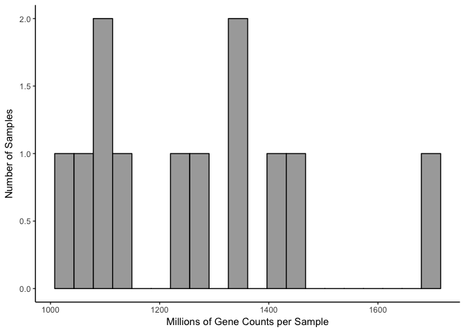
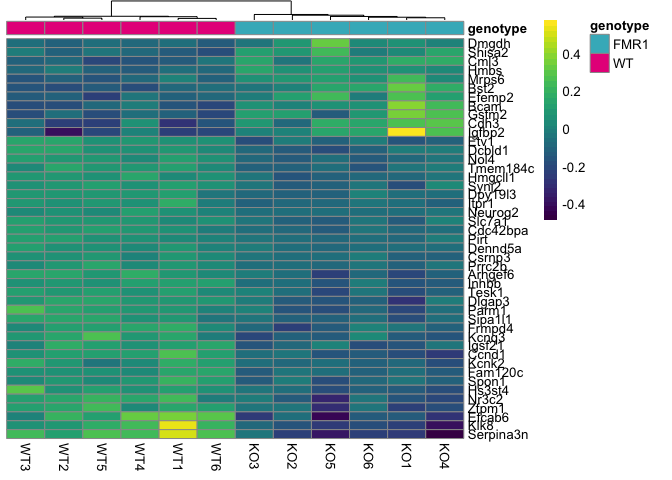
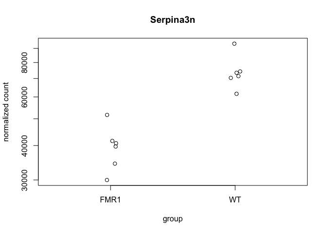
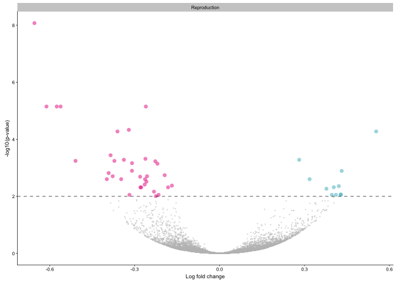
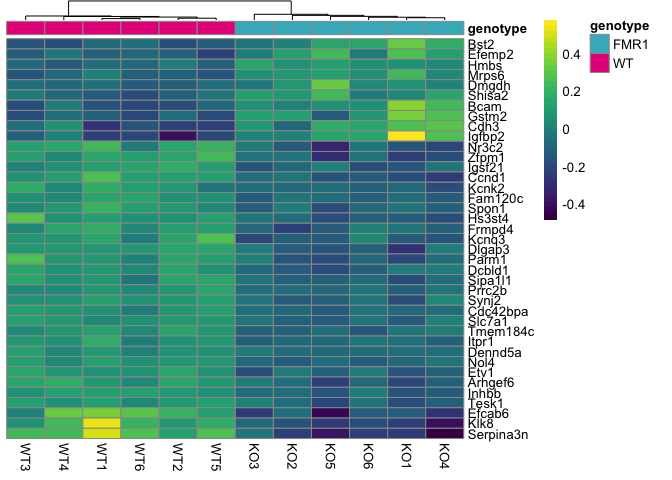
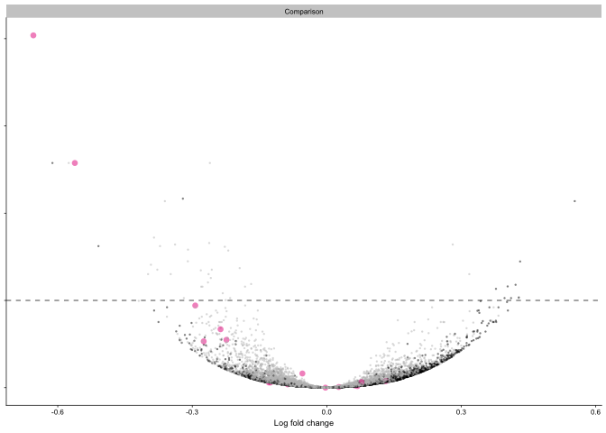
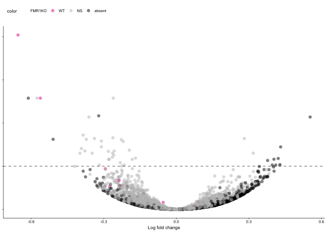

Reproduction of and comparison to the Ceolin et al. 2017 study.
---------------------------------------------------------------

From [Ceolin L, Bouquier N, Vitre-Boubaker J, Rialle S et al. Cell
Type-Specific mRNA Dysregulation in Hippocampal CA1 Pyramidal Neurons of
the Fragile X Syndrome Mouse Model. Front Mol Neurosci 2017;10:340.
PMID:
29104533](https://www.frontiersin.org/articles/10.3389/fnmol.2017.00340/full)

This data was made available here [open source
data](https://www.ncbi.nlm.nih.gov/geo/query/acc.cgi?acc=GSE94559).

The parts of their paper that I reproduced are visuzalized in Figure 2
and 3 of Ceolin et al 2017. Ceolin's fluoresence staining of the CA1
provided the inspriation for the color palette. I reproduced the heatmap
and part of the GO anlsysis but not that of FMRP binding. Then, I
compared this "reproduced analysis of the Ceolin data" to my primary
results to identify genes that robustly change expression in CA1
following *Fmr1* gene knock out.

I reproduced the data from the Ceolin et al. 2017 which used
fluorescence labeling to selectively sequence pyramidal neurons in the
CA1 subfield of the hippocampus from WT and FMR1-KO mice (Fig 2A). My
reproduction of their data produced a very similar pattern of gene
expression and list of differentially expressed genes with roughly equal
up and downregulation of expression. Then, I asked how many of their
differentially expressed genes are differentially expressed in my study.
I found found that downregulation of expression of Cacna1g, Efcab6,
Serpina3n, and Sstr3 was consistent in both the Coelin data and in my
data (Fig 2B). Next, I check to see if the genes that I calculated to be
significantly different als identified by Coelin and described as
significantly different. I determined that 39 of top 45 most significant
(p &lt; 0.01) genes in my analysis make up over half of the most
significant (p &lt; 0.05) genes of from the Ceolin study (Fig 2C). Of my
list of "replicated" 39 differentially expressed genes, two genes
(Serpina3a and Efcab6) were also identified in my analysis of
differential expression (Fig 2D). My GO analysis highlighted different
but also overlapping patterns. The Ceolin study highlights the molecular
function enriched pathways in FMR1-KO mice, but my analysis provided
stronger evidence for a deletion of calcium receptor-related functions
(Fig 2E). This suggests a role for dysregulation of calcium signaling in
the hippocampus of Fragile X Syndrome patients and is consistent with my
research findings.

 Reproducing the Ceolin study for direct
comparison of results. A) Graphical representation of the samples for
the Ceolin et al. 2017 study examining CA1 expression in WT and FMR1-KO
mice. B) Reproduction: This volcano plot shows that my analysis of the
Ceolin et al count data identified 88 genes that are up-regulated in
FMR1-KO mice and the 146 genes that are up-regulated in WT mice a p &lt;
0.05. Comparison: The gene expression and significance values from the
Ceolin data are color-coded by the levels of significance from my
results described in Fig 2.8. Four genes that are upregulated in WT in
my study were also upregulated in my reproduction of the Ceolin data. C)
Analysis showing that 39 of top 45 most significant (p &lt; 0.01) genes
in my reproduction of the analysis, make up over half of the top most
significant (p &lt; 0.05) genes of from the Ceolin study. D)
Hierarchical clustering shows the names and expression patterns of those
same significant genes. D) GO analysis showing a very similar pattern of
depletion of calcium channel activity as was shown in Fig. 2.8). In
contrast, Ceolin detected enrichment of ribosomal processes in response
to FMR1-KO in CA1 pyramidal neurons. Legend) Teal: Enriched in FMR1-KO,
pink: enriched in WT, grey: genes with insignificant expression, black:
genes whos expression was not calculated in my original analysis

Here is the analysis, including the heatmap as well as a PCA plot and
maybe some statistics. The GO analysis is in the subdirectory
06\_GO\_MWU.

    #source("http://www.bioconductor.org/biocLite.R")
    #biocLite("DESeq2")
    library(DESeq2)
    library(magrittr)
    library(tidyverse)
    library(plyr)
    library(reshape2)
    library(VennDiagram)
    library(genefilter)
    library(pheatmap)
    library(edgeR)
    library(colorRamps) # for a matlab like color scheme
    library(viridis)
    library(genefilter)  ## for PCA fuction
    library(ggrepel) ## for labeling volcano plot
    library(cowplot)

    source("functions_RNAseq.R")

    # set output file for figures 
    knitr::opts_chunk$set(fig.path = '../figures/05_Ceolin/')

    # contains a file with the gene name and transcript id
    geneids <- read.table("../data/geneids.tsv", header=T)

    #read count data 
    count <- read.table("../data/GSE94559_Raw_Counts_RNA-Seq_Ceolin.txt", header = T)

    # strip gene length from data
    count$Gene <- sapply(strsplit(as.character(count$Gene),'\\|'), "[", 1)
    count$gene <- sapply(strsplit(as.character(count$Gene),'\\|'), "[", 1)

    ## join with geneids so we can look at gene level stuff
    countbygene <- full_join(geneids, count)
    countbygene <- countbygene %>% 
      filter(gene != "-")
    countbygene <- countbygene[-c(1,3)] ## keep gene name and counts for samples)

    ## lengthen the dataframe, then wide with gene level sums, then make gene the row name, then round the value to nearest integer
    countbygene <- melt(countbygene, id=c("gene")) 
    countbygene  <- dcast(countbygene, gene ~ variable, value.var= "value", fun.aggregate=sum)
    row.names(countbygene) <- countbygene$gene
    countbygene[1] <- NULL
    countbygene <- round(countbygene)

    # getting ready for DESeq2
    countData <- countbygene 

    # meta data
    sample=c("KO1", "KO2", "KO3", "KO4","KO5", "KO6", 
               "WT1", "WT2","WT3", "WT4", "WT5", "WT6") 
    genotype=c("FMR1_KO", "FMR1_KO", "FMR1_KO", "FMR1_KO", "FMR1_KO", "FMR1_KO", 
               "WT", "WT","WT", "WT", "WT", "WT") 

    colData <- data.frame(sample,genotype)
    rownames(colData) <- colData$sample

    # keep only data with >2 counts
    countData[countData < 2] <- 0

    # replace nas with 0
    countData[is.na(countData)] <- 0

The first thing I notice is that they have waay more reads per sample
and thus gene counts per sample than I do. They have a mean gene counts
per sample around 400 million counts per gene. My data had 5 million
counts per gene.

    counts <- countData
    dim( counts )

    FALSE [1] 37167    12

    colSums( counts ) / 1e06  # in millions of reads

    FALSE      KO1      KO2      KO3      KO4      KO5      KO6      WT1      WT2 
    FALSE 1418.315 1350.637 1138.349 1227.207 1713.639 1262.710 1462.382 1096.985 
    FALSE      WT3      WT4      WT5      WT6 
    FALSE 1328.221 1041.819 1051.388 1079.573

    table( rowSums( counts ) )[ 1:30 ] # Number of genes with low counts

    FALSE 
    FALSE     0     2     3     4     5     6     7     8     9    10    11    12 
    FALSE 17743    63    46    48    28    29    24    21    17    18    13    10 
    FALSE    13    14    15    16    17    18    19    20    21    22    23    24 
    FALSE    14    12     4    11    10    12    10     7     6     5    11     5 
    FALSE    25    26    27    28    29    30 
    FALSE    10     6     7   183     2     8

    rowsum <- as.data.frame(colSums( counts ) / 1e06 )
    names(rowsum)[1] <- "millioncounts"
    rowsum$sample <- row.names(rowsum)

    ggplot(rowsum, aes(x=millioncounts)) + 
      geom_histogram(bins = 20, colour = "black", fill = "darkgrey") +
      theme_classic() +
      scale_x_continuous(name = "Millions of Gene Counts per Sample") +
      scale_y_continuous(name = "Number of Samples")

Then I conducted differential gene experssion with DESeq2 modeling the
effect genotype.

    dds <- DESeqDataSetFromMatrix(countData = countData,
                                  colData = colData,
                                  design = ~ genotype )

    FALSE converting counts to integer mode

    dds <- dds[ rowSums(counts(dds)) > 2, ] ## filter genes with 0 counts
    dds <- DESeq(dds) # Differential expression analysis

    FALSE estimating size factors

    FALSE estimating dispersions

    FALSE gene-wise dispersion estimates

    FALSE mean-dispersion relationship

    FALSE final dispersion estimates

    FALSE fitting model and testing

    dds

    FALSE class: DESeqDataSet 
    FALSE dim: 19361 12 
    FALSE metadata(1): version
    FALSE assays(3): counts mu cooks
    FALSE rownames(19361): 0610005C13Rik 0610007P14Rik ... Zzef1 Zzz3
    FALSE rowData names(27): baseMean baseVar ... deviance maxCooks
    FALSE colnames(12): KO1 KO2 ... WT5 WT6
    FALSE colData names(3): sample genotype sizeFactor

    ## for variance stablized gene expression and log transformed data
    rld <- rlog(dds, blind=FALSE)

    res <- results(dds, contrast =c("genotype", "FMR1_KO", "WT"), independentFiltering = T, alpha = 0.1)
    summary(res)

    FALSE 
    FALSE out of 19361 with nonzero total read count
    FALSE adjusted p-value < 0.1
    FALSE LFC > 0 (up)     : 88, 0.45% 
    FALSE LFC < 0 (down)   : 146, 0.75% 
    FALSE outliers [1]     : 928, 4.8% 
    FALSE low counts [2]   : 4330, 22% 
    FALSE (mean count < 668)
    FALSE [1] see 'cooksCutoff' argument of ?results
    FALSE [2] see 'independentFiltering' argument of ?results

There are 12 samples (6 WT and 6 FMR1-KO) and 37,167 genes were included
in the analysis, but most were discarded during the normalizaiton and
analysis iwth DESeq such that the expression of only 19,361 genes were
analysed.

**Differentially expressed genes**

-   out of 19361 with nonzero total read count
-   adjusted p-value &lt; 0.1
-   LFC &gt; 0 (up) : 88, 0.45%
-   LFC &lt; 0 (down) : 146, 0.75%

<!-- -->

    colData$genotype <- as.factor(colData$genotype)
    colData %>% select(genotype)  %>%  summary()

    FALSE     genotype
    FALSE  FMR1_KO:6  
    FALSE  WT     :6

    dim(countData)

    FALSE [1] 37167    12

    dim(rld)

    FALSE [1] 19361    12

Then I did my favorite principle component analysis. The clustering of
points shows clear separation of samples by PC1 and PC2 together. PC2 is
signfificant.

    # create the dataframe using my function pcadataframe
    pcadata <- pcadataframe(rld, intgroup=c("genotype"), returnData=TRUE)
    percentVar <- round(100 * attr(pcadata, "percentVar"))

    ## PC1 vs PC2

    PCA12 <- ggplot(pcadata, aes(PC1, PC2, shape = genotype, color = genotype)) + 
      geom_point(size = 3, alpha = 1) +
        xlab(paste0("PC1: ", percentVar[1],"% variance")) +
        ylab(paste0("PC2: ", percentVar[2],"% variance")) +
        scale_color_manual(values =c("#41b6c4", "#e7298a")) +
        theme_cowplot(font_size = 8, line_size = 0.25)  +
        #theme(legend.position="none") +
        scale_shape_manual(values=c(16, 16)) 
    PCA12

    aov1 <- aov(PC1 ~ genotype, data=pcadata)
    summary(aov1) 

    FALSE             Df Sum Sq Mean Sq F value Pr(>F)
    FALSE genotype     1   21.8   21.80   1.905  0.198
    FALSE Residuals   10  114.4   11.44

    aov2 <- aov(PC2 ~ genotype, data=pcadata)
    summary(aov2) 

    FALSE             Df Sum Sq Mean Sq F value  Pr(>F)   
    FALSE genotype     1  41.04   41.04   10.53 0.00879 **
    FALSE Residuals   10  38.97    3.90                   
    FALSE ---
    FALSE Signif. codes:  0 '***' 0.001 '**' 0.01 '*' 0.05 '.' 0.1 ' ' 1

    aov3 <- aov(PC3 ~ genotype, data=pcadata)
    summary(aov3) 

    FALSE             Df Sum Sq Mean Sq F value Pr(>F)
    FALSE genotype     1   0.82   0.819     0.2  0.664
    FALSE Residuals   10  41.00   4.100

The heatmap shows a similar pattern as the volcano plot and PCA analysis
and allows us to visualize patterns of expression with gene names.

    contrast1 <- resvals(contrastvector = c('genotype', 'FMR1_KO', 'WT'), mypval = 0.1)

    FALSE [1] 234

    ## Any padj <0.1
    DEGes <- assay(rld)
    DEGes <- cbind(DEGes, contrast1)
    DEGes <- as.data.frame(DEGes) # convert matrix to dataframe
    DEGes$rownames <- rownames(DEGes)  # add the rownames to the dataframe

    DEGes <- DEGes %>% filter(padjgenotypeFMR1_KOWT < 0.01)

    rownames(DEGes) <- DEGes$rownames
    drop.cols <-colnames(DEGes[,grep("padj|pval|rownames", colnames(DEGes))])
    DEGes <- DEGes %>% select(-one_of(drop.cols))
    DEGes <- as.matrix(DEGes)
    DEGes <- DEGes - rowMeans(DEGes)

    # setting color options
    ann_colors <- list(genotype =  c('FMR1_KO' = (values=c("#41b6c4")), 
                'WT' = (values=c("#e7298a"))))

    df <- as.data.frame(colData(dds)[,c( "genotype")])
    rownames(df) <- names(countData)
    colnames(df) <- "genotype"

    paletteLength <- 40
    myBreaks <- c(seq(min(DEGes), 0, length.out=ceiling(paletteLength/2) + 1), 
                  seq(max(DEGes)/paletteLength, max(DEGes), length.out=floor(paletteLength/2)))

    pheatmap(DEGes, show_colnames=T, show_rownames = T,
             annotation_col=df, 
             annotation_colors = ann_colors,
             treeheight_row = 0, treeheight_col = 10,
             border_color = "grey60" ,
             color = viridis(40), breaks=myBreaks,
             clustering_distance_cols="correlation" ,
             clustering_method="average"
             )

    # for adobe
    pheatmap(DEGes, show_colnames=F, show_rownames = T,
             annotation_col=df, annotation_colors = ann_colors,
             treeheight_row = 0, treeheight_col = 10,
             fontsize = 4, width=2, height=3.4, cellwidth = 5, 
             border_color = "grey60" ,
             color = viridis(40), breaks=myBreaks,
             clustering_distance_cols="correlation" ,
             clustering_method="average",
             filename = "../figures/05_Ceolin/HeatmapPadj-1.pdf"
             )

Create list of p-values for all genes
-------------------------------------

    #create a new DF with the gene counts
    GOpvals <- assay(rld)
    GOpvals <- cbind(GOpvals, contrast1)
    GOpvals <- as.data.frame(GOpvals)
    GOpvals <- GOpvals[ , grepl( "padj|pval" , names( GOpvals ) ) ]

    GOpvals$gene<-rownames(GOpvals)

    GOpvals <- GOpvals %>%
      select(gene, padjgenotypeFMR1_KOWT)
    GOpvals$logP <- log(GOpvals$padjgenotypeFMR1_KOWT)
    GOpvals <- GOpvals %>%
      select(gene, logP)

    write.csv(GOpvals, "./06_GO_MWU/05_Ceolin_GOpvals.csv", row.names = F)

Volcanos
--------

    res <- results(dds, contrast =c("genotype", "FMR1_KO", "WT"), independentFiltering = T, alpha = 0.1)
    summary(res)

    FALSE 
    FALSE out of 19361 with nonzero total read count
    FALSE adjusted p-value < 0.1
    FALSE LFC > 0 (up)     : 88, 0.45% 
    FALSE LFC < 0 (down)   : 146, 0.75% 
    FALSE outliers [1]     : 928, 4.8% 
    FALSE low counts [2]   : 4330, 22% 
    FALSE (mean count < 668)
    FALSE [1] see 'cooksCutoff' argument of ?results
    FALSE [2] see 'independentFiltering' argument of ?results

    resOrdered <- res[order(res$padj),]
    head(resOrdered, 10)

    FALSE log2 fold change (MAP): genotype FMR1_KO vs WT 
    FALSE Wald test p-value: genotype FMR1_KO vs WT 
    FALSE DataFrame with 10 rows and 6 columns
    FALSE             baseMean log2FoldChange      lfcSE      stat       pvalue
    FALSE            <numeric>      <numeric>  <numeric> <numeric>    <numeric>
    FALSE Serpina3n  56883.323     -0.6544227 0.09087423 -7.201412 5.959231e-13
    FALSE Efcab6     26253.646     -0.5619258 0.09385972 -5.986869 2.139187e-09
    FALSE Klk8       22535.472     -0.5755172 0.09643234 -5.968093 2.400428e-09
    FALSE Neurog2     1318.040     -0.6118730 0.10027296 -6.102074 1.047011e-09
    FALSE Nol4       87295.855     -0.2607096 0.04373721 -5.960820 2.509749e-09
    FALSE Inhbb      26270.049     -0.3209072 0.05716446 -5.613755 1.979828e-08
    FALSE Ccnd1     178320.712     -0.3610653 0.06516270 -5.540981 3.007810e-08
    FALSE Cml3        4536.018      0.5530818 0.09971910  5.546398 2.916154e-08
    FALSE Arhgef6    22052.633     -0.3853633 0.07450660 -5.172203 2.313499e-07
    FALSE Fam120c    74978.612     -0.2622172 0.05143142 -5.098386 3.425618e-07
    FALSE                   padj
    FALSE              <numeric>
    FALSE Serpina3n 8.404304e-09
    FALSE Efcab6    7.078997e-06
    FALSE Klk8      7.078997e-06
    FALSE Neurog2   7.078997e-06
    FALSE Nol4      7.078997e-06
    FALSE Inhbb     4.653586e-05
    FALSE Ccnd1     5.302393e-05
    FALSE Cml3      5.302393e-05
    FALSE Arhgef6   3.625252e-04
    FALSE Fam120c   4.831150e-04

    data <- data.frame(gene = row.names(res), pvalue = -log10(res$padj), lfc = res$log2FoldChange)
    data <- na.omit(data)

    data$wrap <- "Reproduction"
    data <- data %>%
      mutate(color = ifelse(data$lfc > 0 & data$pvalue > 1.3, 
                            yes = "FRM1_KO", 
                            no = ifelse(data$lfc < 0 & data$pvalue > 1.3, 
                                        yes = "WT", 
                                        no = "none")))
    top_labelled <- top_n(data, n = 5, wt = pvalue)

    topGene <- rownames(res)[which.min(res$padj)]
    plotCounts(dds, gene = topGene, intgroup=c("genotype"))

    # Color corresponds to fold change directionality

    volcano <- ggplot(data, aes(x = lfc, y = pvalue)) + 
      geom_point(aes(color = factor(color)), size = 1, alpha = 0.5, na.rm = T) + # add gene points
      theme_cowplot(font_size = 8, line_size = 0.25) +
      geom_hline(yintercept = 1.3,  size = 0.25, linetype = 2) + 
      scale_color_manual(values = c("FRM1_KO" = "#41b6c4",
                                    "WT" = "#e7298a", 
                                    "none" = "grey")) + 
      #scale_y_continuous(limits=c(0, 8)) +
      scale_x_continuous(name="Log fold change")+
      ylab(paste0("log10 p-value")) +       
      theme(panel.grid.minor=element_blank(),
            legend.position = "none", # remove legend 
            panel.grid.major=element_blank()) +
      facet_wrap(~wrap)
    volcano

    pdf(file="../figures/05_Ceolin/volcano.pdf", width=1.25, height=1.85)
    plot(volcano)
    dev.off()

    FALSE quartz_off_screen 
    FALSE                 2

Venn Diagram of both study's DEGS
---------------------------------

    contrast1 <- resvals(contrastvector = c("genotype", "FMR1_KO", "WT"), mypval = 0.01)

    ## [1] 45

    #create a new DF with the gene counts
    rldpvals <- assay(rld)
    rldpvals <- cbind(rldpvals, contrast1)
    rldpvals <- as.data.frame(rldpvals)
    rldpvals <- rldpvals[ , grepl( "padj|pval" , names( rldpvals ) ) ]
    names(rldpvals)

    ## [1] "pvalgenotypeFMR1_KOWT" "padjgenotypeFMR1_KOWT"

    # venn with padj values
    venn1 <- row.names(rldpvals[rldpvals[2] <0.01 & !is.na(rldpvals[2]),])
    venn2 <- read.csv("../data/GSE94559_Ceolin_DEGS.csv", header = F)
    venn2 <- as.matrix(venn2)

    candidates <- list("Harris" = venn1, "Ceolin" = venn2)

    prettyvenn <- venn.diagram(scaled=T,
      x = candidates, filename=NULL, 
      col = "black",
      fill = c( "white", "white"),
      alpha = 0.5,
      cex = 1, fontfamily = "sans", #fontface = "bold",
      cat.default.pos = "text",
      #cat.dist = c(0.1, 0.1, 0.1), cat.pos = 1,
      cat.cex = 1, 
      cat.fontfamily = "sans")
    #dev.off()
    grid.draw(prettyvenn)

    venn12 <- intersect(venn1,venn2)
    write(venn12, "./06_GO_MWU/CeolinHarrisOverlap.csv")

Over reproducible differentially expressed genes
================================================

I took their list of differentially expressed genes at p &lt; 0.05 and
my list at 0.01 and identified the overlap. Then I made a heatmap.

    DEGes <- assay(rld)
    DEGes <- cbind(DEGes, contrast1)
    DEGes <- as.data.frame(DEGes) # convert matrix to dataframe
    DEGes$rownames <- rownames(DEGes)  # add the rownames to the dataframe
    head(DEGes)

    ##                     KO1       KO2       KO3       KO4       KO5       KO6
    ## 0610005C13Rik  3.611345  3.611346  3.611347  3.611346  3.611344  3.611346
    ## 0610007P14Rik 15.600213 15.608739 15.561463 15.529979 15.600742 15.613098
    ## 0610009B22Rik 14.753542 14.669214 14.593776 14.502330 14.593874 14.620354
    ## 0610009L18Rik 10.138022 10.170858 10.134683 10.130807 10.183998 10.067714
    ## 0610009O20Rik 15.040722 14.965714 15.171640 15.123312 14.924288 15.068769
    ## 0610010B08Rik  3.895081  3.892674  3.894827  3.893908  3.894546  3.892744
    ##                     WT1       WT2       WT3       WT4       WT5       WT6
    ## 0610005C13Rik  3.631150  3.611347  3.611346  3.611348  3.611348  3.611348
    ## 0610007P14Rik 15.669142 15.449074 15.564393 15.494937 15.499091 15.661841
    ## 0610009B22Rik 14.755996 14.574368 14.694065 14.597266 14.584117 14.771452
    ## 0610009L18Rik 10.207004 10.110643 10.214312 10.113629 10.140719 10.165465
    ## 0610009O20Rik 15.012408 15.062111 14.909219 15.112654 14.987760 15.020742
    ## 0610010B08Rik  3.895251  3.893922  3.893433  3.893360  3.893246  3.892588
    ##               pvalgenotypeFMR1_KOWT padjgenotypeFMR1_KOWT      rownames
    ## 0610005C13Rik                    NA                    NA 0610005C13Rik
    ## 0610007P14Rik             0.5527989             0.9317704 0610007P14Rik
    ## 0610009B22Rik             0.4314017             0.8982522 0610009B22Rik
    ## 0610009L18Rik             0.4469901             0.9093052 0610009L18Rik
    ## 0610009O20Rik             0.5048276             0.9257121 0610009O20Rik
    ## 0610010B08Rik             0.7848132                    NA 0610010B08Rik

    Coelin <- read.csv("../data/GSE94559_Ceolin_DEGS.csv", header = F)
    colnames(Coelin)<- c("rownames")
    DEGes <- inner_join(DEGes, Coelin)

    ## Joining, by = "rownames"

    ## Warning in inner_join_impl(x, y, by$x, by$y, suffix$x, suffix$y): joining
    ## character vector and factor, coercing into character vector

    DEGes <- DEGes %>% filter(rownames != "Col1a1")

    DEGes <- DEGes %>% filter(padjgenotypeFMR1_KOWT < 0.01)

    rownames(DEGes) <- DEGes$rownames
    drop.cols <-colnames(DEGes[,grep("padj|pval|rownames", colnames(DEGes))])
    DEGes <- DEGes %>% select(-one_of(drop.cols))
    DEGes <- as.matrix(DEGes)
    DEGes <- DEGes - rowMeans(DEGes)
    head(DEGes)

    ##                 KO1          KO2         KO3         KO4         KO5
    ## Arhgef6  -0.2004604 -0.056993577 -0.02237768 -0.10420246 -0.23512035
    ## Bcam      0.3991167  0.008573789  0.06473852  0.23344046  0.06244969
    ## Bst2      0.3332190  0.008613677 -0.03036083  0.17159418  0.15969635
    ## Ccnd1    -0.1716210 -0.027392769 -0.06597490 -0.25058705 -0.15683952
    ## Cdc42bpa -0.0792575 -0.091549812 -0.06758961 -0.05032265 -0.12327327
    ## Cdh3      0.2616079 -0.074718437  0.09414620  0.28390925  0.17376357
    ##                  KO6         WT1        WT2         WT3          WT4
    ## Arhgef6  -0.08489931  0.08121122  0.1513336  0.15679762  0.174831927
    ## Bcam      0.06207792 -0.16154375 -0.1884787 -0.17002907 -0.008485504
    ## Bst2      0.14706322 -0.07980882 -0.1762138 -0.16335101 -0.187867398
    ## Ccnd1    -0.12238987  0.27960396  0.1165120  0.05532832  0.109603622
    ## Cdc42bpa -0.04306319  0.05370122  0.1022245  0.11635424  0.080781457
    ## Cdh3      0.15395102 -0.27636985 -0.2319666 -0.05323882  0.052547233
    ##                  WT5         WT6
    ## Arhgef6   0.10092002  0.03895937
    ## Bcam     -0.09666804 -0.20519197
    ## Bst2     -0.12835602 -0.05422853
    ## Ccnd1     0.12148001  0.11227719
    ## Cdc42bpa  0.12032494 -0.01833033
    ## Cdh3     -0.23610781 -0.14752371

    # setting color options
    ann_colors <- list(genotype =  c('FMR1_KO' = (values=c("#41b6c4")), 
                'WT' = (values=c("#e7298a"))))

    df <- as.data.frame(colData(dds)[,c( "genotype")])
    rownames(df) <- names(countData)
    colnames(df) <- "genotype"

    paletteLength <- 40
    myBreaks <- c(seq(min(DEGes), 0, length.out=ceiling(paletteLength/2) + 1), 
                  seq(max(DEGes)/paletteLength, max(DEGes), length.out=floor(paletteLength/2)))

    pheatmap(DEGes, show_colnames=T, show_rownames = T,
             annotation_col=df, 
             annotation_colors = ann_colors,
             treeheight_row = 0, treeheight_col = 10,
             border_color = "grey60" ,
             color = viridis(40), breaks=myBreaks,
             clustering_distance_cols="correlation" ,
             clustering_method="average"
             )

    pheatmap(DEGes, show_colnames=F, show_rownames = T,
             annotation_col=df, annotation_colors = ann_colors,
             treeheight_row = 0, treeheight_col = 0,
             fontsize = 5, width=2, height=3.4, cellwidth = 5, 
             border_color = "grey60" ,
             color = viridis(40), breaks=myBreaks,
             clustering_distance_cols="correlation" ,
             clustering_method="average",
             filename = "../figures/05_Ceolin/HeatmapOverlap.pdf"
             )

    pointcolor <- read.csv("../results/FMR1_CA1_rnaseq.csv")

    res <- results(dds, contrast =c("genotype", "FMR1_KO", "WT"), independentFiltering = T, alpha = 0.1)
    summary(res)

    ## 
    ## out of 19361 with nonzero total read count
    ## adjusted p-value < 0.1
    ## LFC > 0 (up)     : 88, 0.45% 
    ## LFC < 0 (down)   : 146, 0.75% 
    ## outliers [1]     : 928, 4.8% 
    ## low counts [2]   : 4330, 22% 
    ## (mean count < 668)
    ## [1] see 'cooksCutoff' argument of ?results
    ## [2] see 'independentFiltering' argument of ?results

    resOrdered <- res[order(res$padj),]
    head(resOrdered, 10)

    ## log2 fold change (MAP): genotype FMR1_KO vs WT 
    ## Wald test p-value: genotype FMR1_KO vs WT 
    ## DataFrame with 10 rows and 6 columns
    ##             baseMean log2FoldChange      lfcSE      stat       pvalue
    ##            <numeric>      <numeric>  <numeric> <numeric>    <numeric>
    ## Serpina3n  56883.323     -0.6544227 0.09087423 -7.201412 5.959231e-13
    ## Efcab6     26253.646     -0.5619258 0.09385972 -5.986869 2.139187e-09
    ## Klk8       22535.472     -0.5755172 0.09643234 -5.968093 2.400428e-09
    ## Neurog2     1318.040     -0.6118730 0.10027296 -6.102074 1.047011e-09
    ## Nol4       87295.855     -0.2607096 0.04373721 -5.960820 2.509749e-09
    ## Inhbb      26270.049     -0.3209072 0.05716446 -5.613755 1.979828e-08
    ## Ccnd1     178320.712     -0.3610653 0.06516270 -5.540981 3.007810e-08
    ## Cml3        4536.018      0.5530818 0.09971910  5.546398 2.916154e-08
    ## Arhgef6    22052.633     -0.3853633 0.07450660 -5.172203 2.313499e-07
    ## Fam120c    74978.612     -0.2622172 0.05143142 -5.098386 3.425618e-07
    ##                   padj
    ##              <numeric>
    ## Serpina3n 8.404304e-09
    ## Efcab6    7.078997e-06
    ## Klk8      7.078997e-06
    ## Neurog2   7.078997e-06
    ## Nol4      7.078997e-06
    ## Inhbb     4.653586e-05
    ## Ccnd1     5.302393e-05
    ## Cml3      5.302393e-05
    ## Arhgef6   3.625252e-04
    ## Fam120c   4.831150e-04

    data <- data.frame(gene = row.names(res), pvalue = -log10(res$padj), lfc = res$log2FoldChange)
    data <- na.omit(data)

    tempdata <- left_join(data, pointcolor, by = "gene")

    ## Warning in left_join_impl(x, y, by$x, by$y, suffix$x, suffix$y): joining
    ## factors with different levels, coercing to character vector

    tempdata$color <- as.character(tempdata$color)
    tempdata$color[is.na(tempdata$color)] <- "absent"
    tempdata$color <- as.factor(tempdata$color)
    levels(tempdata$color) <- list(FMR1KO="FMR1", WT="WT", NS = "none",absent="absent")

    tempdata$wrap <- "Comparison"

    # Color corresponds to fold change directionality

    suzyvolcano <- ggplot(tempdata, aes(x = lfc.x, y = pvalue.x)) + 
      geom_point(aes(color = color, shape = color, size = color), alpha = 0.5, na.rm = T) + # add gene points
      theme_cowplot(font_size = 8, line_size = 0.25) +
      geom_hline(yintercept = 1.3,  size = 0.25, linetype = 2) + 
      scale_color_manual(values = c("FMR1KO" = "#41b6c4",
                                    "WT" = "#e7298a", 
                                    "NS" = "grey",
                                    "absent" = "black")) + 
      #scale_y_continuous(limits=c(0, 8)) +
      scale_x_continuous(name="Log fold change")+
      scale_shape_manual(values=c(16, 16, 16, 16)) +
      scale_size_manual(values=c(2,2, 0.5, 0.5)) +
     scale_y_continuous(name=NULL,
                        labels = NULL)+      
      theme(panel.grid.minor=element_blank(),
            legend.position = "none", # remove legend 
            panel.grid.major=element_blank()) +
      facet_wrap(~wrap)
    suzyvolcano

    pdf(file="../figures/05_Ceolin/suzyvolcano.pdf", width=1, height=1.85)
    plot(suzyvolcano)
    dev.off()

    ## quartz_off_screen 
    ##                 2

    legendvolcano <- ggplot(tempdata, aes(x = lfc.x, y = pvalue.x)) + 
      geom_point(aes(color = color, shape = color, size = color), alpha = 0.5, na.rm = T) + # add gene points
      theme_cowplot(font_size = 9, line_size = 0.25) +
      geom_hline(yintercept = 1.3,  size = 0.25, linetype = 2) + 
      scale_color_manual(values = c("FMR1KO" = "#41b6c4",
                                    "WT" = "#e7298a", 
                                    "NS" = "grey",
                                    "absent" = "black")) + 
      #scale_y_continuous(limits=c(0, 8)) +
      scale_x_continuous(name="Log fold change")+
      scale_shape_manual(values=c(16, 16, 16, 16)) +
      scale_size_manual(values=c(2,2, 0.5, 0.5)) +
     scale_y_continuous(name=NULL,
                        labels = NULL)+      
      theme(panel.grid.minor=element_blank(),
            #legend.position = "none", # remove legend 
            panel.grid.major=element_blank())
    legendvolcano

    pdf(file="../figures/05_Ceolin/legendvolcano.pdf", width=1, height=1.75)
    plot(legendvolcano)
    dev.off()

    ## quartz_off_screen 
    ##                 2

    # list top deges
    mytopgenes <- tempdata %>%
      filter(color %in% c("WT", "FMR1"), pvalue.x > 1.3)
    head(mytopgenes)

    ##        gene pvalue.x      lfc.x pvalue.y      lfc.y color       wrap
    ## 1   Cacna1g 1.883471 -0.2933235 1.002905 -0.5563997    WT Comparison
    ## 2    Efcab6 5.150028 -0.5619258 1.003320 -0.6767416    WT Comparison
    ## 3 Serpina3n 8.075498 -0.6544227 1.002905 -0.4769215    WT Comparison
    ## 4     Sstr3 1.339407 -0.2368854 1.003320 -0.6729482    WT Comparison

    mytopgenes$gene

    ## [1] "Cacna1g"   "Efcab6"    "Serpina3n" "Sstr3"
