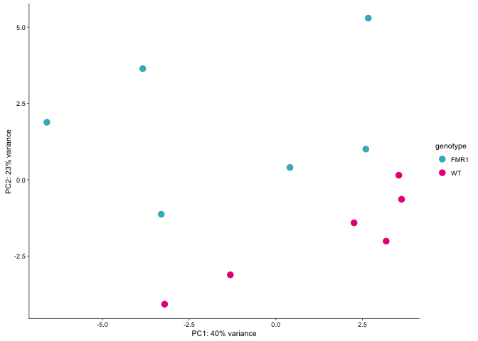

Ceolin et al. data reanalyzed
-----------------------------

From [Ceolin L, Bouquier N, Vitre-Boubaker J, Rialle S et al. Cell
Type-Specific mRNA Dysregulation in Hippocampal CA1 Pyramidal Neurons of
the Fragile X Syndrome Mouse Model. Front Mol Neurosci 2017;10:340.
PMID:
29104533](https://www.frontiersin.org/articles/10.3389/fnmol.2017.00340/full)

This data was made available here [open source
data](https://www.ncbi.nlm.nih.gov/geo/query/acc.cgi?acc=GSE94559).

The parts of their paper that I reproduced are visuzalized in Figure 2
and 3 of Ceolin et al 2017. Ceolin's fluoresence staining of the CA1
provided the inspriation for the color palette. I reproduced the heatmap
and part of the GO anlsysis but not that of FMRP binding.

My reanalysis produeces very similar results.

We found rougly the same scale of gene expression changes, but my list
contained fewer genes. Most of the genes were identified by both
analytical methods indicating a robust reponse. Our GO anlaysese
highlighted different patterns. Ceolin highlights the molecular function
enriched pathways in FMR1-KO mice, but my analysis provided stronger
evidence for a deletion of calcium receptor related functions. THis
suggests a role for dys-regulation of calcium signallying in the
hippocampus of Fragile X Syndrom patients.

Here is the analysis, including the heatmap as well as a PCA plot and
maybe some statistics. The GO analysis is in the subdirectory
06\_GO\_MWU.

The first thing I notice is that they have waay more reads per sample
and thus gene counts per sample than I do. They have a mean gene counts
per sample around 400 million counts per gene. My data had 5 million
counts per gene.

Differential gene experssion with DESeq2 modeling genotype
==========================================================

    dds <- DESeqDataSetFromMatrix(countData = countData,
                                  colData = colData,
                                  design = ~ genotype )

    FALSE converting counts to integer mode

    dds <- dds[ rowSums(counts(dds)) > 2, ] ## filter genes with 0 counts
    dds <- DESeq(dds) # Differential expression analysis

    FALSE estimating size factors

    FALSE estimating dispersions

    FALSE gene-wise dispersion estimates

    FALSE mean-dispersion relationship

    FALSE final dispersion estimates

    FALSE fitting model and testing

    dds

    FALSE class: DESeqDataSet 
    FALSE dim: 19361 12 
    FALSE metadata(1): version
    FALSE assays(3): counts mu cooks
    FALSE rownames(19361): 0610005C13Rik 0610007P14Rik ... Zzef1 Zzz3
    FALSE rowData names(27): baseMean baseVar ... deviance maxCooks
    FALSE colnames(12): KO1 KO2 ... WT5 WT6
    FALSE colData names(3): sample genotype sizeFactor

    ## for variance stablized gene expression and log transformed data
    rld <- rlog(dds, blind=FALSE)

There are 12 samples (6 WT and 6 FMR1-KO) and 37,167 genes were included
in the analysis, but most were discarded during the normalizaiton and
analysis iwth DESeq such that the expression of only 19,361 genes were
analysed.

    ##     genotype
    ##  FMR1_KO:6  
    ##  WT     :6

    ## [1] 37167    12

    ## [1] 19361    12

Principle component analysis
============================

Nice clusering of points. PC1 and PC2 together separate samples by
genotype. PC2 is signfificant

ANOVA PCA
=========

    aov1 <- aov(PC1 ~ genotype, data=pcadata)
    summary(aov1) 

    FALSE             Df Sum Sq Mean Sq F value Pr(>F)
    FALSE genotype     1   21.8   21.80   1.905  0.198
    FALSE Residuals   10  114.4   11.44

    aov2 <- aov(PC2 ~ genotype, data=pcadata)
    summary(aov2) 

    FALSE             Df Sum Sq Mean Sq F value  Pr(>F)   
    FALSE genotype     1  41.04   41.04   10.53 0.00879 **
    FALSE Residuals   10  38.97    3.90                   
    FALSE ---
    FALSE Signif. codes:  0 '***' 0.001 '**' 0.01 '*' 0.05 '.' 0.1 ' ' 1

    aov3 <- aov(PC3 ~ genotype, data=pcadata)
    summary(aov3) 

    FALSE             Df Sum Sq Mean Sq F value Pr(>F)
    FALSE genotype     1   0.82   0.819     0.2  0.664
    FALSE Residuals   10  41.00   4.100

Heatmap
=======

Create list of p-values for all genes
-------------------------------------

Differentially expressed genes
==============================

out of 19361 with nonzero total read count adjusted p-value &lt; 0.1 LFC
&gt; 0 (up) : 88, 0.45% LFC &lt; 0 (down) : 146, 0.75%

### Serpina3n was in my list, right? and Ccnd1?

    res <- results(dds, contrast =c("genotype", "FMR1_KO", "WT"), independentFiltering = T, alpha = 0.1)
    summary(res)

    ## 
    ## out of 19361 with nonzero total read count
    ## adjusted p-value < 0.1
    ## LFC > 0 (up)     : 88, 0.45% 
    ## LFC < 0 (down)   : 146, 0.75% 
    ## outliers [1]     : 928, 4.8% 
    ## low counts [2]   : 4330, 22% 
    ## (mean count < 668)
    ## [1] see 'cooksCutoff' argument of ?results
    ## [2] see 'independentFiltering' argument of ?results

    resOrdered <- res[order(res$padj),]
    head(resOrdered, 10)

    ## log2 fold change (MAP): genotype FMR1_KO vs WT 
    ## Wald test p-value: genotype FMR1_KO vs WT 
    ## DataFrame with 10 rows and 6 columns
    ##             baseMean log2FoldChange      lfcSE      stat       pvalue
    ##            <numeric>      <numeric>  <numeric> <numeric>    <numeric>
    ## Serpina3n  56883.323     -0.6544227 0.09087423 -7.201412 5.959231e-13
    ## Efcab6     26253.646     -0.5619258 0.09385972 -5.986869 2.139187e-09
    ## Klk8       22535.472     -0.5755172 0.09643234 -5.968093 2.400428e-09
    ## Neurog2     1318.040     -0.6118730 0.10027296 -6.102074 1.047011e-09
    ## Nol4       87295.855     -0.2607096 0.04373721 -5.960820 2.509749e-09
    ## Inhbb      26270.049     -0.3209072 0.05716446 -5.613755 1.979828e-08
    ## Ccnd1     178320.712     -0.3610653 0.06516270 -5.540981 3.007810e-08
    ## Cml3        4536.018      0.5530818 0.09971910  5.546398 2.916154e-08
    ## Arhgef6    22052.633     -0.3853633 0.07450660 -5.172203 2.313499e-07
    ## Fam120c    74978.612     -0.2622172 0.05143142 -5.098386 3.425618e-07
    ##                   padj
    ##              <numeric>
    ## Serpina3n 8.404304e-09
    ## Efcab6    7.078997e-06
    ## Klk8      7.078997e-06
    ## Neurog2   7.078997e-06
    ## Nol4      7.078997e-06
    ## Inhbb     4.653586e-05
    ## Ccnd1     5.302393e-05
    ## Cml3      5.302393e-05
    ## Arhgef6   3.625252e-04
    ## Fam120c   4.831150e-04

    data <- data.frame(gene = row.names(res), pvalue = -log10(res$padj), lfc = res$log2FoldChange)
    data <- na.omit(data)
    data <- data %>%
      mutate(color = ifelse(data$lfc > 0 & data$pvalue > 1.3, 
                            yes = "FRM1_KO", 
                            no = ifelse(data$lfc < 0 & data$pvalue > 1.3, 
                                        yes = "WT", 
                                        no = "none")))
    top_labelled <- top_n(data, n = 5, wt = pvalue)

    # Color corresponds to fold change directionality

    volcano <- ggplot(data, aes(x = lfc, y = pvalue)) + 
      geom_point(aes(color = factor(color)), size = 1, alpha = 0.5, na.rm = T) + # add gene points
      theme_cowplot(font_size = 8, line_size = 0.25) +
      geom_hline(yintercept = 1,  size = 0.25, linetype = 2) + 
      scale_color_manual(values = c("FRM1_KO" = "#41b6c4",
                                    "WT" = "#e7298a", 
                                    "none" = "grey")) + 
      #scale_y_continuous(limits=c(0, 8)) +
      scale_x_continuous(name="Log fold change")+
      ylab(paste0("log10 p-value")) +       
      theme(panel.grid.minor=element_blank(),
            legend.position = "none", # remove legend 
            panel.grid.major=element_blank())
    volcano

    pdf(file="../figures/05_Ceolin/volcano.pdf", width=1.5, height=1.75)
    plot(volcano)
    dev.off()

    ## quartz_off_screen 
    ##                 2
