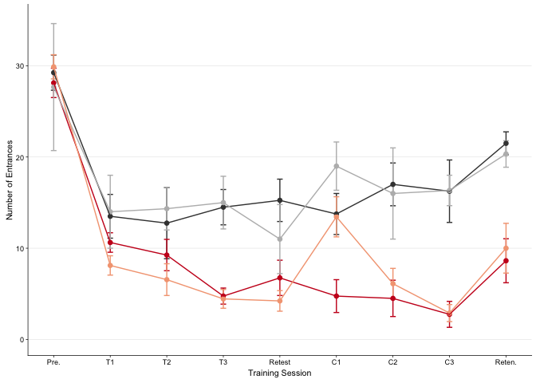

 Fig. 2.5. Summary of punishment
and estimates of memory in WT and FMR1-KO mice A) Expected results for
number of entrances based on data from Chapter 1 and Radwan et al.8 B,C)
Consistent and conflict trained mice from WT and FMR1-KO groups to make
fewer entrances into the shock zone than yoked-mice; however, the
pattern does not exactly match the expected results. D) Expected results
for number of entrances based on data from Chapter 1 and Radwan et al.8
E, F) Consistent and conflict trained mice from WT FMR1-KO do not show
evidence of place memory until after the first day of initial training.
This pattern does also not mirror the expected results. Legend) Pre:
pre-training; T1, T2, T3: training sessions 1-3; C1, C2, C3: conflict
training sessions; Reten.: retention session; dark grey:
yoked-consistent, red: consistently-trained, light grey: yoked-conflict,
peach: conflict-trained. The pie-shaped shaded regions of the inserts
highlight the region used to count the number of entrances.

These are the packages required for making the figures and doing stats.

    library(dplyr) # for subsetting data 
    library(car) # for fancy ANOVA
    library(ggplot2) # for plotting
    library(cowplot) # for "easier"" ggplot themes

    knitr::opts_chunk$set(fig.path = '../figures/01_behavior/')

    colorvalAPA2 <-  c( "#404040","#ca0020", "#bababa", "#f4a582")

This chuck of code is for loading and formatting the dataframes.

    PathNum <- read.csv("../results/behaviordatasummary.csv", header = T)
    PathNum$APA2 <- factor(PathNum$APA2, levels = c("yoked-consistent","consistent", "yoked-conflict","conflict")) ## relevel then rename factors treatment
    PathNum$Genotype <- factor(PathNum$Genotype, levels = c("WT","FMR1KO")) # relevel genotype

5B Number of entrances in WT
============================

    numenrwt <- PathNum  %>% 
      #filter(TrainSessionComboNum != "1", TrainSessionComboNum != "9") %>% 
      filter(measure == "Number of Entrances") %>% 
      filter(Genotype == "WT") %>% 
      droplevels()  %>% 
      ggplot(aes(x=, TrainSessionComboNum, y=m, color=APA2, shape=Genotype)) + 
        geom_errorbar(aes(ymin=m-se, ymax=m+se), width=.1) +
        geom_point(size = 2) +
       geom_line(aes(colour=APA2, linetype=Genotype)) +
       scale_y_continuous(name= "Number of Entrances",
                          limits = c(0,35)) +
        scale_x_continuous(name="Training Session", 
                           breaks = c(1, 2, 3, 4, 5, 6, 7, 8, 9),
                           labels = c( "Pre.", "T1", "T2", "T3",
                                       "Retest", "C1", "C2" ,"C3", 
                                       "Reten.")) +
      theme_cowplot(font_size = 8, line_size = 0.25) +
      background_grid(major = "y", minor="non") +
      scale_color_manual(values = colorvalAPA2)  +
      theme(legend.title=element_blank()) +
      theme(legend.position="none") +
      scale_shape_manual(values=c(16, 1)) 
    numenrwt

    pdf(file="../figures/01_behavior/numenrwt.pdf", width=2.25, height=2)
    plot(numenrwt)
    dev.off()

    ## quartz_off_screen 
    ##                 2

5C Number of entrances in FMR1-KO
=================================

    numenrfmr1 <- PathNum  %>% 
      filter(TrainSessionComboNum != "1", TrainSessionComboNum != "9") %>% 
      filter(measure == "Number of Entrances") %>% 
      filter(Genotype != "WT") %>% 
      ggplot(aes(x=, TrainSessionComboNum, y=m, color=APA2, shape=Genotype)) + 
        geom_errorbar(aes(ymin=m-se, ymax=m+se), width=.1) +
        geom_point(size = 2) +
       geom_line(linetype = 2, aes(colour=APA2)) +
       scale_y_continuous(name= "Number of Entrances",
                          limits = c(0,35)) +
        scale_x_continuous(name="Training Session", 
                           breaks = c(1, 2, 3, 4, 5, 6, 7, 8, 9),
                           labels = c( "Pre.", "T1", "T2", "T3",
                                       "Retest", "C1", "C2","C3", 
                                      "Reten.")) +
      theme_cowplot(font_size = 8, line_size = 0.25) +
      background_grid(major = "y", minor = "none") +
      scale_color_manual(values = colorvalAPA2)  +
      theme(legend.title=element_blank()) +
      theme(legend.position="none") +
      scale_shape_manual(values=c(1)) 
    numenrfmr1

    pdf(file="../figures/01_behavior/numenrfmr1.pdf", width=2.25, height=2)
    plot(numenrfmr1)
    dev.off()

    ## quartz_off_screen 
    ##                 2

5E Path to first entrances in WT
--------------------------------

    pathwt <- PathNum  %>% 
      #filter(TrainSessionComboNum != "1", TrainSessionComboNum != "9") %>% 
      filter(measure == "Path to the 1st Entrance") %>% 
      filter(Genotype == "WT") %>% 
      ggplot(aes(x=, TrainSessionComboNum, y=m, color=APA2, shape=Genotype)) + 
        geom_errorbar(aes(ymin=m-se, ymax=m+se), width=.1) +
        geom_point(size = 2) +
       geom_line(linetype = 1, aes(colour=APA2)) +
       scale_y_continuous(name= "Path to the 1st Entrance",
                          limits = c(0,17.5)) +
        scale_x_continuous(name="Training Session", 
                           breaks = c(1, 2, 3, 4, 5, 6, 7, 8, 9),
                           labels = c( "Pre.", "T1", "T2", "T3",
                                       "Retest", "C1", "C2","C3", 
                                       "Reten.")) +
      theme_cowplot(font_size = 8, line_size = 0.25) +
      background_grid(major = "y", minor = "none") +
      scale_color_manual(values = colorvalAPA2)  +
      theme(legend.title=element_blank()) +
      theme(legend.position="none") +
      scale_shape_manual(values=c(16)) 
    pathwt

    pdf(file="../figures/01_behavior/pathwt.pdf", width=2.25, height=2)
    plot(pathwt)
    dev.off()

    ## quartz_off_screen 
    ##                 2

5F Path to first entrances in FMR1-KO
-------------------------------------

    pathfmr1 <- PathNum  %>% 
      filter(measure == "Path to the 1st Entrance") %>% 
      filter(Genotype != "WT") %>% 
      ggplot(aes(x=, TrainSessionComboNum, y=m, color=APA2, shape=Genotype)) + 
        geom_errorbar(aes(ymin=m-se, ymax=m+se), width=.1) +
        geom_point(size = 2) +
       geom_line(linetype = 2, aes(colour=APA2)) +
       scale_y_continuous(name= "Path to the 1st Entrance",
                          limits = c(0,17.5)) +
        scale_x_continuous(name="Training Session", 
                           breaks = c(1, 2, 3, 4, 5, 6, 7, 8, 9),
                           labels = c( "Pre.", "T1", "T2", "T3",
                                       "Retest", "C1", "C2", "C3", 
                                        "Reten.")) +
      theme_cowplot(font_size = 8, line_size = 0.25) +
      background_grid(major = "y", minor = "none") +
      scale_color_manual(values = colorvalAPA2)  +
      theme(legend.title=element_blank()) +
      theme(legend.position="none") +
      scale_shape_manual(values=c(1)) 
    pathfmr1

    pdf(file="../figures/01_behavior/pathfmr1.pdf", width=2.25, height=2)
    plot(pathfmr1)
    dev.off()

    ## quartz_off_screen 
    ##                 2
